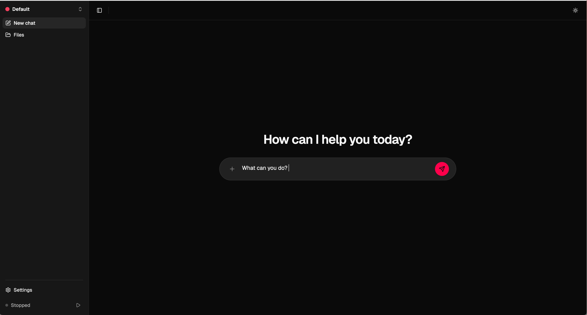
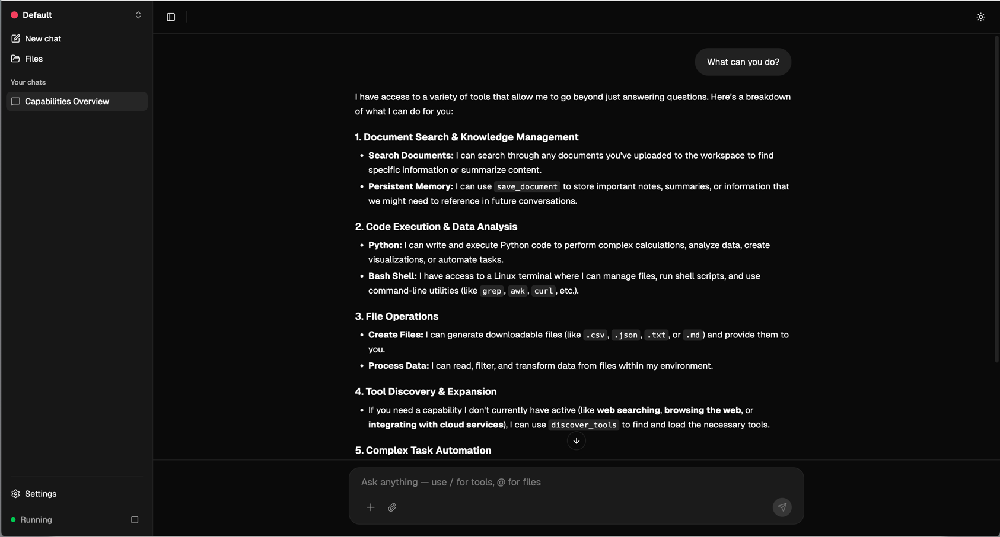

# AgentBuddy

**Self-hosted, privacy-first AI agent platform with sandboxed tool execution.**

[](LICENSE)

<p align="center">
  
</p>
<p align="center">
  
</p>

---

## Quick Start

One command. That's it.

```bash
curl -fsSL https://raw.githubusercontent.com/DanielD2G/AgentBuddy/main/bootstrap.sh | bash
```

This will check Docker, set up environment variables, start all services, and initialize the database. Once done, open **http://localhost:4321** and follow the setup wizard.

> You'll need at least one AI provider API key (OpenAI, Anthropic, or Google Gemini).

---

## What is AgentBuddy?

AgentBuddy is an open-source AI agent platform that runs entirely on your infrastructure. Upload documents, chat with AI, and let it execute tasks — all within isolated Docker sandboxes, with your data never leaving your machine.

It combines **document RAG** (upload anything, search semantically), **sandboxed code execution** (Bash, Python, Docker, Kubernetes, AWS, GitHub), **browser automation** with anti-detection, and a **multi-workspace** architecture where each workspace has its own tools, permissions, and knowledge base.

### Inspired by OpenClaw

AgentBuddy was born from using [OpenClaw](https://github.com/openclaw/openclaw) and wanting something more privacy-focused, with stronger isolation and multi-user support. We're grateful to the OpenClaw team for building such an inspiring project and pushing the open-source AI agent space forward.

---

## Why AgentBuddy over OpenClaw?

| | AgentBuddy | OpenClaw |
|---|---|---|
| **Execution isolation** | Every tool runs in a Docker sandbox with resource limits (512MB RAM, 1 vCPU, 100 PIDs) | Direct shell access on host machine |
| **Multi-workspace** | Full workspace isolation — each with its own capabilities, permissions, documents, and chat history | Single profile model |
| **Credential security** | API keys encrypted at rest with AES-256-GCM | Plain text or environment variables |
| **Tool approvals** | Built-in approval workflow with glob-pattern permission rules (session or global scope) | No granular permission system |
| **Browser automation** | BrowserGrid with Camoufox anti-detection, fingerprint injection, and live view dashboard | Chrome DevTools Protocol |
| **Dynamic tool discovery** | RAG-based — only loads relevant tools per query instead of dumping all tools into context | All tools always loaded |
| **Context compression** | Automatic summarization of old messages to stay within token limits | Manual context management |
| **Privacy** | Fully self-hosted, zero telemetry, no external calls except your chosen LLM provider | Requires careful configuration to avoid data leaks |
| **LLM providers** | Claude, GPT, Gemini (chat + embeddings) with per-workspace model configuration | Multi-model but tightly coupled |
| **Document RAG** | Vector search with Qdrant, chunked embeddings, semantic retrieval | Limited document handling |

---

## Features

### Agent Capabilities

Six sandboxed tools your AI can use, each running in isolated Docker containers:

| Tool | What it does |
|------|-------------|
| **Bash** | Shell commands with curl, wget, jq, git |
| **Python** | Full Python 3 with venv, data analysis, scripting |
| **Docker** | Build, run, and manage containers |
| **Kubectl** | Kubernetes cluster management |
| **AWS CLI** | S3, EC2, Lambda, CloudFormation, and 200+ AWS services |
| **GitHub CLI** | Repos, issues, PRs, actions, releases, secrets |

Each capability is defined as a `.skill` file — easy to read, modify, or create new ones. See [Creating Skills](docs/creating-skills.md).

### Document RAG

Upload documents (PDF, Markdown, Word, text, HTML, CSV, JSON) and search them semantically. Documents are chunked, embedded, and stored in Qdrant for fast vector retrieval. The AI automatically searches your knowledge base when answering questions.

### Browser Automation

Powered by [BrowserGrid](libs/browsergrid/) — an open-source multi-browser automation grid with anti-detection capabilities:

- **Three browser engines**: Camoufox (deepest anti-detection), Chromium, Firefox
- **Fingerprint injection**: Each session gets a unique, consistent fingerprint that passes CreepJS and BrowserScan
- **Live view dashboard**: Watch browser sessions in real-time via WebSocket streaming
- **Step-by-step execution**: The AI discovers elements before interacting, avoiding blind clicking
- **Session persistence**: Cookies and state carry over between tool calls
- **Optimized for LLMs**: Screenshots sent as vision-native ImageBlocks (~2,700 tokens vs ~80,000 as raw text)

### Web Search

Real-time web search via Google Search API. The AI automatically uses web search for current information and browser automation for deeper exploration.

### Google Workspace

Full integration with Gmail, Calendar, Drive, Tasks, Docs, Sheets, and Slides via OAuth — read, create, and manage your Google Workspace from chat.

### Cron Scheduling

Create recurring tasks with standard cron expressions. The AI can set up automated workflows that run on schedule.

### Tool Discovery

When you have many capabilities enabled (6+), AgentBuddy uses RAG-based tool discovery to load only the relevant tools per query. This keeps the LLM context clean and improves response quality.

### Context Compression

Long conversations are automatically compressed — old messages get summarized by a compact LLM model while keeping the last 10 messages intact. No more hitting token limits mid-conversation.

### Permission System

- **Auto-execute mode**: Trusted workspaces can run tools without approval
- **Tool approvals**: Review and approve/deny tool calls before execution
- **Permission rules**: Create glob-pattern rules like `Bash(aws s3 *)` that auto-approve matching commands
- **Scoped rules**: Session-specific or workspace-wide

---

## Architecture

```
┌─────────────────────────────────────────────────────────┐
│                    AgentBuddy                           │
│                                                         │
│  ┌──────────┐   ┌──────────┐   ┌────────────────────┐  │
│  │  React   │──▶│  Hono    │──▶│  LLM Providers     │  │
│  │  Frontend│   │  API     │   │  (Claude/GPT/      │  │
│  │  :4321   │   │  :4000   │   │   Gemini)          │  │
│  └──────────┘   └────┬─────┘   └────────────────────┘  │
│                      │                                   │
│        ┌─────────────┼─────────────┐                    │
│        │             │             │                     │
│  ┌─────▼────┐  ┌─────▼────┐  ┌────▼─────┐              │
│  │PostgreSQL│  │  Qdrant  │  │  MinIO   │              │
│  │  :5433   │  │  :6333   │  │  :9000   │              │
│  │  (data)  │  │ (vectors)│  │ (files)  │              │
│  └──────────┘  └──────────┘  └──────────┘              │
│                                                         │
│  ┌──────────┐  ┌───────────────────────┐               │
│  │  Redis   │  │     BrowserGrid       │               │
│  │  :6380   │  │  :9090                │               │
│  │ (queues) │  │  Camoufox / Chromium  │               │
│  └──────────┘  │  / Firefox            │               │
│                └───────────────────────┘               │
│                                                         │
│  ┌─────────────────────────────────────┐               │
│  │         Docker Sandboxes            │               │
│  │  (isolated per-workspace containers)│               │
│  └─────────────────────────────────────┘               │
└─────────────────────────────────────────────────────────┘
```

### Tech Stack

| Layer | Technology |
|-------|-----------|
| Frontend | React 19, Vite, TailwindCSS v4, Radix UI |
| Backend | Hono, Bun, TypeScript |
| Database | PostgreSQL 16, Prisma 6 |
| Vector DB | Qdrant |
| Object Storage | MinIO (S3-compatible) |
| Queue | BullMQ + Redis 7 |
| Browser | BrowserGrid (Playwright + Camoufox) |
| Sandboxing | Docker containers with resource limits |
| Auth | Better Auth |

### LLM Support

| Provider | Chat Models | Embedding Models |
|----------|------------|-----------------|
| **OpenAI** | GPT-5.4, GPT-5, GPT-4.1, GPT-4o, O3, O3-mini | text-embedding-3-small, text-embedding-3-large |
| **Anthropic** | Claude Opus 4.6, Sonnet 4.6, Haiku 4.5 | — |
| **Google** | Gemini 3.1 Pro, 3 Flash, 2.5 Pro/Flash | gemini-embedding-001, gemini-embedding-002 (beta) |

---

## BrowserGrid

[BrowserGrid](libs/browsergrid/) is an open-source multi-browser automation grid. It provides managed browser sessions with anti-detection capabilities, usable standalone or integrated into any project.

**Key features:**
- **Camoufox** — C++ level fingerprint spoofing (canvas, WebGL, fonts, navigator, screen, timezone)
- **Chromium & Firefox** — Playwright context options with JS init scripts
- **Persistent contexts** — cookies and storage reused across sessions
- **Live view** — Real-time screen streaming at 10 FPS via WebSocket
- **Download management** — Per-session file downloads via REST API
- **Resource efficient** — Camoufox ~194MB, Chromium ~255MB per instance

---

## Development Setup

For contributors who want to run AgentBuddy in development mode:

### Prerequisites

- [Bun](https://bun.sh/) v1.3+
- [Docker](https://docs.docker.com/get-docker/) with Compose
- An API key for at least one LLM provider

### Steps

```bash
# Clone the repo
git clone https://github.com/DanielD2G/AgentBuddy.git
cd AgentBuddy

# Install dependencies
bun install

# Set up environment
cp .env.example .env
# Edit .env with your API keys

# Start infrastructure (Postgres, Redis, Qdrant, MinIO, BrowserGrid)
docker compose up -d

# Push database schema
cd apps/api && bunx prisma db push && cd ../..

# Start dev servers (API + Web)
bun dev
```

### Build Sandbox Images

```bash
make build-sandbox-images
```

This builds the Docker images used for sandboxed tool execution (base, python, aws-cli, kubectl, node, full).

---

## Service URLs

| Service | URL |
|---------|-----|
| Web App | http://localhost:4321 |
| API | http://localhost:4000 |
| API Docs (Swagger) | http://localhost:4000/api/docs |
| Qdrant Dashboard | http://localhost:6333/dashboard |
| MinIO Console | http://localhost:9001 |
| BrowserGrid Dashboard | http://localhost:9090 |

---

## License

MIT License — see [LICENSE](LICENSE) for details.

---

## Acknowledgments

- **[OpenClaw](https://github.com/openclaw/openclaw)** — For inspiring this project and showing the world what open-source AI agents can do. AgentBuddy exists because OpenClaw proved the concept; we just wanted to take it further with stronger privacy, isolation, and multi-workspace support.
- **[Playwright](https://playwright.dev/)** — Browser automation engine powering BrowserGrid.
- **[Camoufox](https://github.com/nicehash/camoufox)** — Stealthy Firefox fork for anti-detection browsing.
