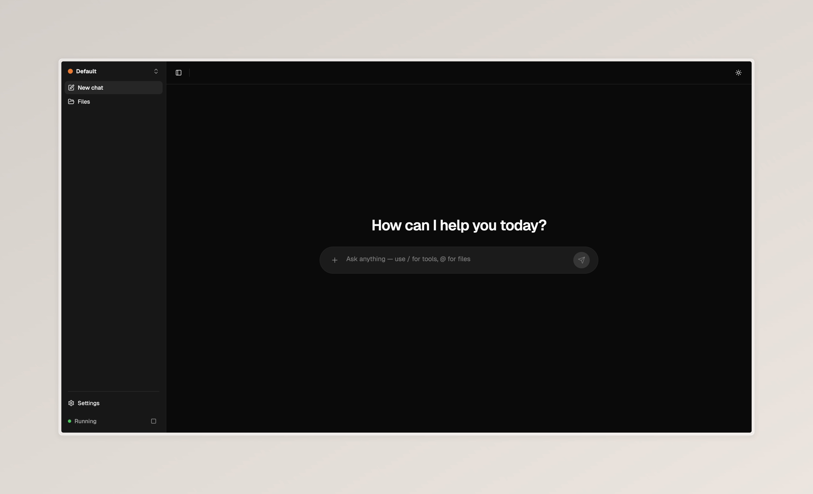
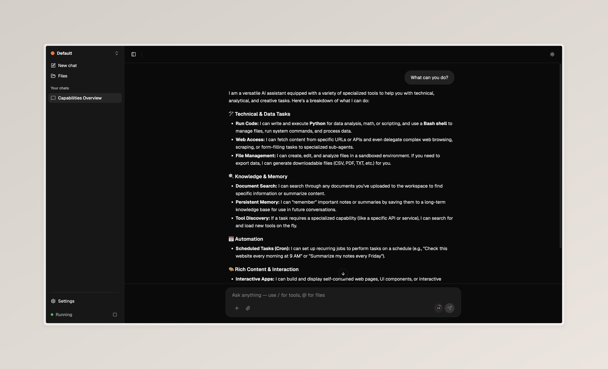
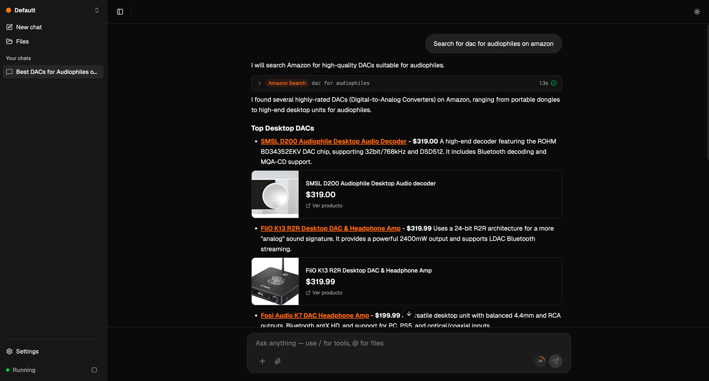
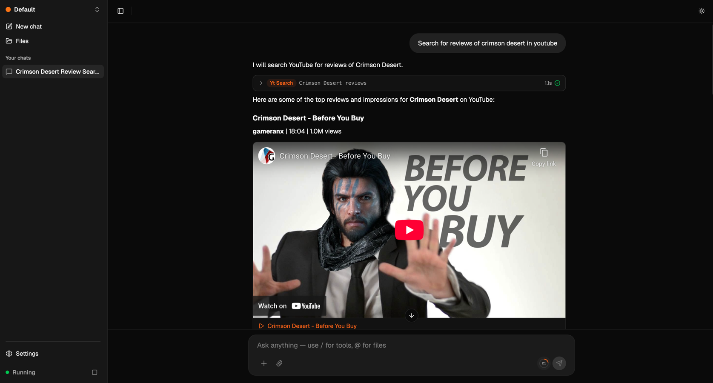
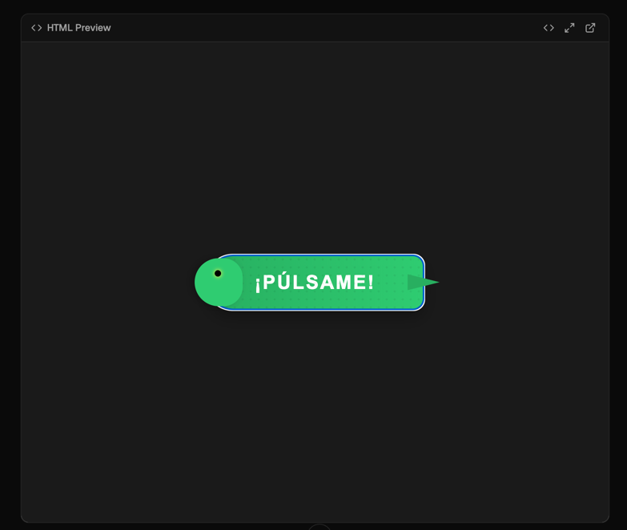
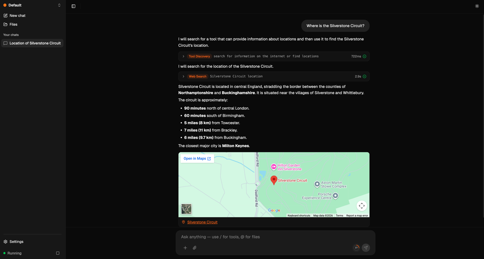

# ClawBuddy

**Self-hosted, privacy-first AI agent platform with sandboxed tool execution.**

[](LICENSE)

<p align="center">
  
</p>

<details>
<summary><strong>More screenshots</strong></summary>
<br>
<p align="center">
  
</p>
<p align="center">
  
</p>
<p align="center">
  
</p>
<p align="center">
  
</p>
<p align="center">
  
</p>
</details>

---

## Quick Start

One command. That's it.

```bash
curl -fsSL https://raw.githubusercontent.com/DanielD2G/ClawBuddy/main/scripts/bootstrap.sh | bash
```

This downloads the compose file, pulls pre-built images from GHCR, and starts all services. Once done, open **http://localhost:4321** and follow the setup wizard.

> You'll need at least one AI provider API key (OpenAI, Anthropic, or Google Gemini). See the **[API Keys & OAuth Setup Guide](docs/api-keys-setup.md)** for step-by-step instructions.

---

## What is ClawBuddy?

ClawBuddy is an open-source AI agent platform that runs entirely on your infrastructure. Upload documents, chat with AI, and let it execute tasks — all within isolated Docker sandboxes, with your data never leaving your machine.

---

## Features

### Agent Capabilities

Six sandboxed tools your AI can use, each running in isolated Docker containers:

| Tool | What it does |
|------|-------------|
| **Bash** | Shell commands with curl, wget, jq, git |
| **Python** | Full Python 3 with venv, data analysis, scripting |
| **Docker** | Build, run, and manage containers |
| **Kubectl** | Kubernetes cluster management |
| **AWS CLI** | S3, EC2, Lambda, CloudFormation, and 200+ AWS services |
| **GitHub CLI** | Repos, issues, PRs, actions, releases, secrets |

Each capability is defined as a `.skill` file — easy to read, modify, or create new ones. See [Creating Skills](docs/creating-skills.md).

### Sub-Agent Delegation

The primary agent can delegate tasks to lightweight sub-agents that run on smaller, faster models (Haiku/Flash). Each sub-agent is assigned a role that determines which tools it can access:

| Role | Access | Use case |
|------|--------|----------|
| **Explore** | Read-only tools (web search, web fetch, document search) | Research and information gathering |
| **Analyze** | Read-only tools | Data analysis and summarization |
| **Execute** | Full tool access (bash, python, docker, etc.) | Running commands and performing actions |

Sub-agents run independently and return their results to the primary agent, keeping the main conversation context clean while parallelizing work.

### Search Skills

Built-in skills that let the AI search external platforms directly from the chat:

| Skill | What it does |
|-------|-------------|
| **Amazon Search** | Search products on Amazon.com — returns names, prices, links, and images with rich product cards |
| **MercadoLibre Search** | Search products on MercadoLibre Argentina — prices in ARS, direct links, and product images |
| **YouTube Search** | Search YouTube videos — returns titles, channels, durations, view counts, and embedded video players |

Skills run inside sandboxed Python containers with network access, so your credentials stay safe.

### Rich Content Blocks

Agent responses aren't just text — ClawBuddy renders rich, interactive blocks inline:

- **Product cards** — Product image, price, and direct link rendered as visual cards when using search skills
- **YouTube embeds** — Videos returned by YouTube Search are embedded as playable players directly in the chat
- **HTML Preview** — The agent can generate HTML/CSS/JS and render it as a live, interactive preview with a built-in code viewer
- **Maps** — Location queries render an interactive Google Maps embed with pins and an "Open in Maps" link

### Document RAG

Upload documents (PDF, Markdown, Word, text, HTML, CSV, JSON) and search them semantically. Documents are chunked, embedded, and stored in Qdrant for fast vector retrieval. The AI automatically searches your knowledge base when answering questions.

- Folder-based organization with hierarchical nesting
- Drag-and-drop uploads with status tracking (pending, processing, ready, failed)
- Re-ingestion capability for updated documents
- @ mention documents or folders directly in chat to scope searches

### Agent Memory

A persistent knowledge base the agent can write to and read from across conversations. The agent saves documents, notes, and generated files that persist beyond a single chat session — building long-term context about your projects and preferences.

### Browser Automation

Powered by [BrowserGrid](https://github.com/DanielD2G/BrowserGrid) — an open-source multi-browser automation grid with anti-detection capabilities:

- **Three browser engines**: Camoufox (deepest anti-detection), Chromium, Firefox
- **Fingerprint injection**: Each session gets a unique, consistent fingerprint that passes CreepJS and BrowserScan
- **Live view dashboard**: Watch browser sessions in real-time via WebSocket streaming
- **Step-by-step execution**: The AI discovers elements before interacting, avoiding blind clicking
- **Session persistence**: Cookies and state carry over between tool calls
- **Optimized for LLMs**: Screenshots sent as vision-native ImageBlocks (~2,700 tokens vs ~80,000 as raw text)

### Web Search

Real-time web search via Google Search API. The AI automatically uses web search for current information and browser automation for deeper exploration.

### Google Workspace

Full integration with Google Workspace via OAuth:

| Service | Capabilities |
|---------|-------------|
| **Gmail** | Read, search, send, and manage emails |
| **Calendar** | View agenda, create and manage events |
| **Drive** | List, upload, and download files |
| **Tasks** | Create and manage task lists |
| **Docs** | Read and create documents |
| **Sheets** | Read and create spreadsheets |
| **Slides** | Read and create presentations |

### Cron Scheduling

Create recurring tasks with standard cron expressions. The AI can set up automated workflows that run on schedule, powered by BullMQ and Redis.

### Channels

Connect external messaging platforms as chat interfaces for your agent:

- **Telegram** — Link a Telegram bot to any workspace. Messages flow through the same agent pipeline with full tool access, RAG, and permissions.

More channel integrations are planned.

### Tool Discovery

When you have many capabilities enabled (6+), ClawBuddy uses RAG-based tool discovery to load only the relevant tools per query. This keeps the LLM context clean and improves response quality — instead of dumping all tool definitions into every request.

### Context Compression

Long conversations are automatically compressed — old messages get summarized by a compact LLM model while keeping the last 10 messages intact. No more hitting token limits mid-conversation.

---

## Security & Privacy

ClawBuddy is designed with security at every layer:

- **Sandboxed execution** — Every tool runs in a Docker container with hard resource limits: 512MB RAM, 1 vCPU, 100 PIDs, 5-minute timeout
- **Encrypted credentials** — API keys stored with AES-256-GCM encryption at rest
- **Secret redaction** — Secrets are automatically stripped from tool outputs, SSE streams, logs, and database storage before reaching the LLM or being persisted
- **Tool approvals** — Review and approve/deny tool calls before execution. Create glob-pattern rules like `Bash(aws s3 *)` for auto-approval (session-scoped or workspace-wide)
- **Auto-execute mode** — Trusted workspaces can run tools without approval prompts
- **Zero telemetry** — Fully self-hosted, no external calls except to your chosen LLM provider
- **Network isolation** — Sandboxes have no network access by default (opt-in per capability)

---

## Admin Dashboard

A built-in admin panel for managing your ClawBuddy instance:

- **Stats overview** — Workspace, document, and conversation counts at a glance
- **Token usage analytics** — Per-provider and per-model token consumption with 7-day rolling window
- **Workspace management** — Search, paginate, and manage all workspaces
- **Document management** — View document statuses, filter by state, trigger re-ingestion
- **Conversation browser** — Search and review agent conversations
- **Sandbox sessions** — Monitor active Docker sandbox containers
- **Model configuration** — Configure models and parameters per provider
- **Auto-approval rules** — Manage global permission rules
- **Preflight checks** — Validate all infrastructure connections (database, Redis, Qdrant, MinIO, Docker, BrowserGrid)

---

## Workspace Management

Each workspace is a fully isolated environment with its own:

- **Capabilities** — Choose which tools are available (Bash, Python, Docker, Browser, etc.)
- **Documents** — Separate knowledge base with folder organization
- **Chat history** — Independent conversation threads
- **Permissions** — Per-workspace auto-execute mode and approval rules
- **Credentials** — Workspace-scoped Google OAuth tokens and capability configs

Workspaces can be **exported** as a full backup (configuration, capabilities, documents) and **imported** into another instance — making it easy to share setups or migrate between environments.

---

## Architecture

```
┌─────────────────────────────────────────────────────────┐
│                    ClawBuddy                           │
│                                                         │
│  ┌──────────┐   ┌──────────┐   ┌────────────────────┐  │
│  │  React   │──▶│  Hono    │──▶│  LLM Providers     │  │
│  │  Frontend│   │  API     │   │  (Claude/GPT/      │  │
│  │  :4321   │   │  :4000   │   │   Gemini)          │  │
│  └──────────┘   └────┬─────┘   └────────────────────┘  │
│                      │                                   │
│        ┌─────────────┼─────────────┐                    │
│        │             │             │                     │
│  ┌─────▼────┐  ┌─────▼────┐  ┌────▼─────┐              │
│  │PostgreSQL│  │  Qdrant  │  │  MinIO   │              │
│  │  :5433   │  │  :6333   │  │  :9000   │              │
│  │  (data)  │  │ (vectors)│  │ (files)  │              │
│  └──────────┘  └──────────┘  └──────────┘              │
│                                                         │
│  ┌──────────┐  ┌───────────────────────┐               │
│  │  Redis   │  │     BrowserGrid       │               │
│  │  :6380   │  │  :9090                │               │
│  │ (queues) │  │  Camoufox / Chromium  │               │
│  └──────────┘  │  / Firefox            │               │
│                └───────────────────────┘               │
│                                                         │
│  ┌─────────────────────────────────────┐               │
│  │         Docker Sandboxes            │               │
│  │  (isolated per-workspace containers)│               │
│  └─────────────────────────────────────┘               │
└─────────────────────────────────────────────────────────┘
```

### Tech Stack

| Layer | Technology |
|-------|-----------|
| Frontend | React 19, Vite, TailwindCSS v4, Radix UI |
| Backend | Hono, Bun, TypeScript |
| Database | PostgreSQL 16, Prisma 6 |
| Vector DB | Qdrant |
| Object Storage | MinIO (S3-compatible) |
| Queue | BullMQ + Redis 7 |
| Browser | BrowserGrid (Playwright + Camoufox) |
| Sandboxing | Docker containers with resource limits |

### LLM Support

| Provider | Chat Models | Embedding Models |
|----------|------------|-----------------|
| **OpenAI** | GPT-5.4, GPT-5, GPT-4.1, GPT-4o, O3, O3-mini | text-embedding-3-small, text-embedding-3-large |
| **Anthropic** | Claude Opus 4.6, Sonnet 4.6, Haiku 4.5 | — |
| **Google** | Gemini 3.1 Pro, 3 Flash, 2.5 Pro/Flash | gemini-embedding-001, gemini-embedding-002 (beta) |

---

## BrowserGrid

[BrowserGrid](https://github.com/DanielD2G/BrowserGrid) is an open-source multi-browser automation grid. It provides managed browser sessions with anti-detection capabilities, usable standalone or integrated into any project.

- **Camoufox** — C++ level fingerprint spoofing (canvas, WebGL, fonts, navigator, screen, timezone)
- **Chromium & Firefox** — Playwright context options with JS init scripts
- **Persistent contexts** — Cookies and storage reused across sessions
- **Live view** — Real-time screen streaming at 10 FPS via WebSocket
- **Download management** — Per-session file downloads via REST API
- **Resource efficient** — Camoufox ~194MB, Chromium ~255MB per instance

---

## Development Setup

For contributors who want to run ClawBuddy in development mode:

### Prerequisites

- [Bun](https://bun.sh/) v1.3+
- [Docker](https://docs.docker.com/get-docker/) with Compose
- An API key for at least one LLM provider ([setup guide](docs/api-keys-setup.md))

### Steps

```bash
# Clone the repo
git clone https://github.com/DanielD2G/ClawBuddy.git
cd ClawBuddy

# Install dependencies
bun install

# Set up environment
cp .env.example .env
# Edit .env with your API keys (see docs/api-keys-setup.md)

# Start the development stack in Docker Compose with live reload
make dev

# Rebuild the development images when Docker deps change
make dev-build
```

---

## Service URLs

| Service | URL |
|---------|-----|
| Web App | http://localhost:4321 |
| API | http://localhost:4000 |
| API Docs (Swagger) | http://localhost:4000/api/docs |
| Qdrant Dashboard | http://localhost:6333/dashboard |
| MinIO Console | http://localhost:9001 |
| BrowserGrid Dashboard | http://localhost:9090 |

---

## License

MIT License — see [LICENSE](LICENSE) for details.

---

## Acknowledgments

- **[OpenClaw](https://github.com/openclaw/openclaw)** — For inspiring this project and pushing the open-source AI agent space forward.
- **[Playwright](https://playwright.dev/)** — Browser automation engine powering BrowserGrid.
- **[Camoufox](https://github.com/nicehash/camoufox)** — Stealthy Firefox fork for anti-detection browsing.
